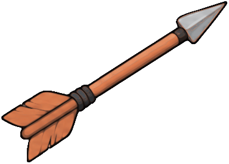
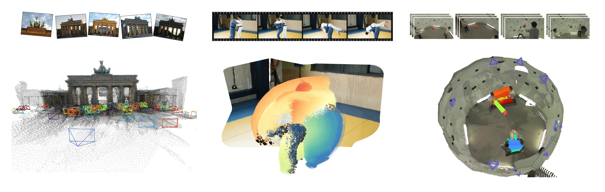

<h1 align="center">
  <picture></picture>
  ARROW
  <picture></picture>
</h1>

<h3 align="center">Arbitrary Reconstruction and Tracking<br />of 4D Observations in the Wild</h3>

<p align="center">
  <a href="https://ifradlin.github.io">Ilya&nbsp;Fradlin</a> &nbsp;&nbsp;
  <a href="https://github.com/Schmiddo">Christian&nbsp;Schmidt</a> &nbsp;&nbsp;
  <a href="https://github.com/jenspiek">Jens&nbsp;Piekenbrinck</a><br />
  <a href="https://karimknaebel.com">Karim&nbsp;Knaebel</a> &nbsp;&nbsp;
  <a href="https://gonzalomartingarcia.com/">Gonzalo&nbsp;Martin&nbsp;Garcia</a> &nbsp;&nbsp;
  <a href="https://scholar.google.com/citations?user=ZcULDB0AAAAJ">Bastian&nbsp;Leibe</a>
</p>

<p align="center">RWTH Aachen University</p>

<p align="center">
  <a href="https://vision.rwth-aachen.de/arrow"></a>
  <a href="https://arxiv.org/abs/2610.01314"></a>
  <a href="#news"></a>
  <a href="#citation"></a>
</p>

<p align="center">
  <br />
  <picture></picture>
</p>

## News

- **2026-10-01:** Our [paper](https://arxiv.org/abs/2610.01314) is available on arXiv.
- **Coming soon:** code and weights. Watch this repository for release updates.

## Overview

**ARROW** is a feed-forward model that unifies **3D reconstruction and 3D point tracking from arbitrary image sets**. It combines the flexible point-query decoding of [D4RT](https://d4rt-paper.github.io/) with support for arbitrary observations across viewpoints and capture times. This enables reconstruction and tracking from moving-camera videos, multiple video streams, and unordered photo collections.

ARROW achieves state-of-the-art 3D tracking on WorldTrack and TAPVid-3D and outperforms dedicated multi-view trackers on an adapted **RGB-only MVTracker benchmark**, remaining competitive on 3D reconstruction tasks.

Visit the [project page](https://vision.rwth-aachen.de/arrow) for interactive examples and results.

## Citation

```bibtex
@article{fradlin2026arrow,
    title         = {{ARROW}: Arbitrary Reconstruction and Tracking of 4D Observations in the Wild},
    author        = {Fradlin, Ilya and Schmidt, Christian and Piekenbrinck, Jens and Knaebel, Karim and Martin Garcia, Gonzalo and Leibe, Bastian},
    year          = 2026,
    journal       = {arXiv preprint arXiv:2610.01314},
}
```

## License

This project is licensed under the [MIT License](LICENSE).
